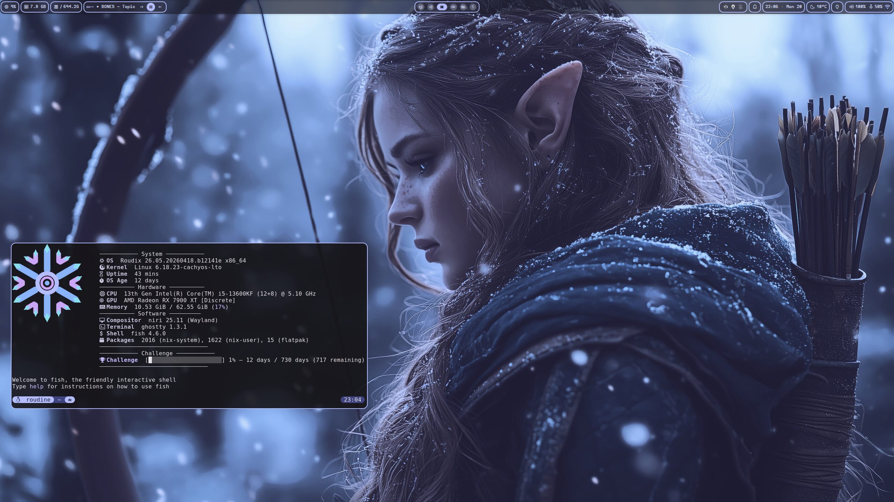

*[English version](README.md)*

<div align="center">


# Roudix
### Configuration NixOS (Unstable) — Plusieurs compositeurs Wayland (hyprland, niri, mangowc et umbriel) · Gnome et KDE · Kernel CachyOS


<br/>

| Niri + DankMaterialShell | Niri + Noctalia |
|:---:|:---:|
|  |  |

<sub>Personnalisation perso — la vôtre sera différente selon votre configuration 👀</sub>

</div>

---

## Matériel

| Composant | Modèle |
|-----------|-------|
| CPU | Intel Core i5-13600KF |
| GPU | AMD Radeon RX 7900 XT |

---

## Stack

| Couche | Choix |
|-------|--------|
| OS | Roudix (NixOS unstable) |
| Kernel | CachyOS (choisissez votre variante dans [Fonctionnalités](docs/features.fr.md) ou dans [Installation](docs/installation.fr.md)) |
| Bootloader | Limine (par défaut) · systemd-boot |
| Compositeur | Niri (tiling scrollable) · Hyprland (tiling dynamique) · MangoWC · Umbriel (tiling scrollable, natif Noctalia) |
| Shell graphique | Noctalia · DankMaterialShell · Caelestia |
| Environnement de bureau | KDE Plasma · Gnome |
| Gestionnaire de connexion | DMS Greeter (Dms uniquement) · Noctalia Greeter (noctalia uniquement) · plasma-login-manager (KDE uniquement) · GDM (Gnome uniquement) |
| Terminal | Configurable (Ghostty, Kitty, Foot, Wezterm, Konsole, Ptyxis) |
| Shell | Fish · Bash |
| Navigateur | Configurable (Brave, Helium, Vivaldi, Firefox, LibreWolf, Chromium, Zen Twilight) |
| Gestionnaire de fichiers | Configurable (Nautilus, Thunar, Dolphin, Nemo) |
| Éditeur | Configurable (Zed, VS Code, Neovim, aucun) |
| Chat | Discord (Vencord · vanilla · aucun) + Matrix (Element · Cinny · aucun) |
| Musique | Configurable (Spotify + Spicetify, YouTube Music Desktop, aucun) |

---

## Documentation

| | |
|-|-|
| 🖥️ [Bureau & shells](docs/desktop.fr.md) | Changer de compositeur et de shell graphique, surcharges personnelles (Niri, Hyprland, GNOME, KDE) |
| ⚡ [Alias & fonctions](docs/aliases.fr.md) | Tous les alias et fonctions shell — `roudix-switch`, `roudix-shell-switch`, `rebuild`… |
| 🚀 [Installation](docs/installation.fr.md) | Guide d'installation automatisée et manuelle |
| ✨ [Fonctionnalités](docs/features.fr.md)  | Liste complète des fonctionnalités par environnement de bureau |
| 🔄 [Mise à jour automatique](docs/autoupdate.fr.md) | Configuration du git pull + rebuild automatique |

---

## Structure

```
roudix/
├── roudix-installer.sh              # Installeur en Bash
├── flake.nix                        # Entrées & sorties
├── flake.lock
├── docs/                            # Documentation
│   ├── desktop.md                   # Environnements de bureau & shells graphiques
│   ├── aliases.md                   # Alias & fonctions shell
│   ├── installation.md              # Guide d'installation
│   ├── features.md                  # Liste des fonctionnalités
│   ├── features.fr.md               # Liste des fonctionnalités (français)
│   └── autoupdate.md                # Configuration de la mise à jour automatique
│
├── hosts/
│   └── roudix/                      # Hôte unique — DE choisi via roudix.desktop.type
│       ├── configuration.nix
│       ├── username.nix             # ignoré par git — votre nom d'utilisateur (voir installation)
│       ├── local.nix                # ignoré par git — vos surcharges système personnelles
│       ├── local.nix.example        # copiez ce fichier en local.nix pour démarrer
│       └── hardware-configuration.nix
│
├── home/                            # Home Manager — configuration au niveau utilisateur
│   ├── common.nix                   # Config home partagée (tous les utilisateurs & DE)
│   ├── local.nix                    # ignoré par git — vos surcharges home personnelles
│   ├── local.nix.example            # copiez ce fichier en home/local.nix pour démarrer
│   ├── niri-custom.nix.example      # optionnel — copiez en niri-custom.nix pour des surcharges niri (auto-importé)
│   ├── umbriel-custom.nix.example   # optionnel — copiez en umbriel-custom.nix pour des surcharges Umbriel (auto-importé)
│   ├── mango-custom.nix.example     # optionnel — copiez en mango-custom.nix pour des surcharges MangoWC (auto-importé)
│   ├── gnome.nix                    # Config home pour GNOME (fond d'écran, thème, icônes, curseur)
│   ├── gnome-extensions.nix         # Extensions GNOME — paquets, UUID activés, réglages dconf
│   ├── kde.nix                      # Config home pour KDE (fond d'écran, thème, icônes, curseur)
│   ├── hyprland.nix                 # Config home pour Hyprland (dépend du shell)
│   ├── mangowc.nix                  # Config home pour MangoWC (screenshot.sh, paquets) — basé texte, pas de schéma Nix typé
│   └── shell-modules.nix            # Imports des modules de shell partagés (noctalia, dms, caelestia)
│
├── dotfiles/                        # Fichiers de config bruts gérés par Home Manager
│   ├── easyeffects/                 # Presets EasyEffects
│   ├── fastfetch/
│   │   └── roudix.txt               # Logo ASCII Roudix par défaut pour fastfetch
│   # niri/, niri-dms/ supprimés — la config niri est désormais
│   # entièrement native Nix (voir modules/home/desktop/niri/ ci-dessous).
│   ├── hyprland/                    # Dotfiles Hyprland + Noctalia
│   │   └── cfg/                     # Config Hyprland découpée (gérée par l'utilisateur — .conf, .lua, etc.)
│   ├── hyprland-dms/                # Dotfiles Hyprland + DankMaterialShell
│   ├── hyprland-caelestia/          # Dotfiles Hyprland + Caelestia
│   └── perso/                       # Config personnelle (ignorée par git)
│
├── pkgs/
│   ├── roudix-branding              # Paquet Roudix Branding
│   ├── roudix-kernel-switcher       # Paquet GUI Roudix Kernel Switcher
│   ├── roudix-switcher/             # GUI Roudix Settings (bureau, gaming, éditeur, terminal, navigateur, shell, gestionnaire de fichiers, chat, système, intégration)
│   └──   roudix-scheduler-switcher    # Paquet GUI Scheduler Switcher
│
└── modules/
    ├── system/                      # Modules NixOS au niveau système
    │   ├── desktop/                 # Modules d'environnement de bureau (niveau NixOS)
    │   ├── default.nix              # Options de bureau (roudix.desktop.type + roudix.desktop.shell)
    │   ├── niri.nix                 # Niri + polkit
    │   ├── hyprland.nix             # Hyprland + UWSM + polkit + xdg-portal
    │   ├── gnome.nix                # GNOME
    │   ├── kde.nix                  # KDE Plasma 6 + plasma-login-manager
    │   ├── mango.nix                # Mangowc + polkit
    │   └── umbriel.nix              # Umbriel + polkit
    │
    ├── autoupdate.nix           # Auto git pull + rebuild lors des changements de config
    ├── binary-caches.nix        # Caches binaires Nix (substituters + clés de confiance)
    ├── boot.nix                 # Bootloader Limine + entrées multi-OS
    ├── boot.local.nix           # ignoré par git — vos entrées de boot personnelles
    ├── boot.local.nix.example   # copiez ce fichier en boot.local.nix pour démarrer
    ├── browser.nix              # Sélection du navigateur (roudix.browsers + roudix.zen.enable)
    ├── common.nix               # Config système partagée (tous les hôtes)
    ├── cpu.nix                  # Config CPU (microcode Intel/AMD + modules i2c)
    ├── desktop-integration.nix  # Stack keyring + xdg-desktop-portal pour les compositeurs nus (roudix.desktopIntegration)
    ├── discord.nix              # Sélection Discord — none / vanilla / vencord (roudix.discord)
    ├── editor.nix               # Sélection de l'éditeur de code — zed / vscode / neovim / none (roudix.editor)
    ├── environment.nix          # Variables d'environnement
    ├── flatpak.nix              # Service Flatpak + mise à jour automatique
    ├── fstrim.nix               # fstrim pour SSD/NVMe
    ├── gaming.nix               # Steam, Gamescope, ananicy-cpp, game-performance (tuned-adm), bascules par application (roudix.gaming.apps.*)
    ├── gpu/                     # Config GPU (AMD/NVIDIA/Intel/VM — séparée par fournisseur)
    ├── hosts-gta.nix            # Bloc hosts BattlEye (fix GTA, optionnel)
    ├── kernel.nix               # Sélection de la variante de kernel — variantes CachyOS + nixpkgs simple (zen/lts/latest/testing)
    ├── keyboard.nix             # Disposition/variante clavier graphique (Wayland) (roudix.keyboardLayout / roudix.keyboardVariant)
    ├── matrix.nix               # Sélection du client Matrix (roudix.matrixClient)
    ├── appimage.nix             # Support AppImage
    ├── openlinkhub.nix          # OpenLinkHub — pilote Corsair iCUE Link + RAM RGB (roudix.memory.*)
    ├── openrgb.nix              # Contrôle LED OpenRGB
    ├── roudix-rgb.nix           # Routage du contrôleur RGB (openlinkhub / openrgb / none)
    ├── pipewire.nix             # Audio PipeWire + réduction de bruit rnnoise
    ├── update.nix               # Configuration de mise à jour de la flake
    ├── version.nix              # Branding Roudix OS (os-release, distroName)
    ├── virtualization.nix       # QEMU/KVM (désactivé par défaut)
    └── vm-guest.nix             # Optimisations invité VM (presse-papiers, agent QEMU, Spice)
    └── # options filemanager, terminal pour choisir votre terminal et gestionnaire de fichiers favoris, via local.nix dans host/roudix/
    │
    └── home/                        # Modules Home Manager au niveau utilisateur
        ├── bash.nix                 # Config du shell Bash + roudix-switch + roudix-shell-switch
        ├── fastfetch.nix            # Fastfetch + autostart fish
        ├── fish.nix                 # Shell Fish + alias + roudix-switch + roudix-shell-switch
        ├── gaming-home.nix          # Paquets gaming utilisateur (proton, mangohud...)
        ├── git.nix                  # Config Git
        ├── mangohud.nix             # Overlay MangoHud
        ├── papirus-icon.nix         # Thème d'icônes Papirus
        ├── papirus-folders.nix      # Configuration des couleurs de dossier Papirus
        ├── tela-icon.nix            # Thème d'icônes Tela
        ├── spicetify.nix            # Spotify + Spicetify (thème Comfy)
        ├── ssh.nix                  # SSH + GitHub
        ├── # mango et hyprland auront bientôt la même approche que niri et umbriel
        └── desktop/                 # Config Home Manager par compositeur (native Nix)
            ├── niri/                # programs.niri.settings, découpé par sujet, dépendant du shell
            │   ├── default.nix      # assemble les réglages, include du thème live, paquets
            │   ├── _general.nix     # environnement, autostart, curseur (dépendant du shell)
            │   ├── _animation.nix
            │   ├── _input.nix
            │   ├── _layout.nix
            │   ├── _output.nix      # sorties + espaces de travail nommés
            │   ├── _ws.nix          # constantes de glyphes d'icônes d'espace de travail partagées
            │   ├── _rules-common.nix
            │   ├── _rules-noctalia.nix / _rules-dms.nix
            │   ├── _binds-noctalia.nix / _binds-dms.nix
            │   └── _include-noctalia.nix / _include-dms.nix  # ajoute l'include du thème live de niri-flake à la config rendue
            └── umbriel/             # programs.umbriel.settings, découpé par sujet (Noctalia uniquement)
                ├── default.nix
                ├── _general.nix / _appearance.nix / _animation.nix / _input.nix
                ├── _layout.nix / _output.nix / _binds.nix / _rules.nix
                └── _include-noctalia.nix  # charge noctalia.toml (l'include natif de thème live d'Umbriel)
```

---

## Entrées de la flake

| Entrée | Source |
|-------|--------|
| nixpkgs | [nixos-unstable](https://github.com/NixOS/nixpkgs/tree/nixos-unstable) |
| nixpkgs-stable | [nixos-26.05](https://github.com/NixOS/nixpkgs/tree/nixos-26.05) |
| niri | [epireyn/niri-flake](https://github.com/epireyn/niri-flake) |
| home-manager | [nix-community/home-manager](https://github.com/nix-community/home-manager) |
| noctalia | [noctalia-dev/noctalia](https://github.com/noctalia-dev/noctalia) |
| umbriel | [noctalia-dev/umbriel](https://github.com/noctalia-dev/umbriel) |
| caelestia-shell | [caelestia-dots/shell](https://github.com/caelestia-dots/shell) |
| dms | [AvengeMedia/DankMaterialShell](https://github.com/AvengeMedia/DankMaterialShell) |
| nix-cachyos-kernel | [xddxdd/nix-cachyos-kernel](https://github.com/xddxdd/nix-cachyos-kernel) |
| chaotic | [chaotic-cx/nyx](https://github.com/chaotic-cx/nyx) |
| zen-browser | [0xc000022070/zen-browser-flake](https://github.com/0xc000022070/zen-browser-flake) |
| spicetify-nix | [Gerg-L/spicetify-nix](https://github.com/Gerg-L/spicetify-nix) |
| millennium | [SteamClientHomebrew/Millennium](https://github.com/SteamClientHomebrew/Millennium) |
| helium | [amaanq/helium-flake](https://github.com/amaanq/helium-flake) |
| nix-flatpak | [gmodena/nix-flatpak](https://github.com/gmodena/nix-flatpak) |
| plasma-manager | [nix-community/plasma-manager](https://github.com/nix-community/plasma-manager) |
| brave-previews | [roudinebwt/brave-preview](https://github.com/roudinebwt/brave-preview) |
| roudix-caches | [RoudineBWT/Roudix-caches](https://github.com/RoudineBWT/Roudix-caches) |
| nix-gaming-edge | [powerofthe69/nix-gaming-edge](https://github.com/powerofthe69/nix-gaming-edge) |
---

## Voir aussi

| Projet | Description |
|---------|-------------|
| [GLF OS](https://framagit.org/gaming-linux-fr/glf-os/glf-os) | Distro gaming basée sur NixOS, par Gaming Linux FR |

---

## Dotfiles personnels

Les fichiers de config personnels vivent dans `dotfiles/perso/` — ils sont ignorés par git (sauf `dotfiles/perso/README.md`) et ne sont jamais touchés par `git pull` ou l'auto-updater.

Voir [`dotfiles/perso/README.md`](dotfiles/perso/README.md) pour la structure et l'usage.

Pour les surcharges au niveau du compositeur (écrans, raccourcis, espacements…), utilisez plutôt les fichiers de surcharge utilisateur générés — ils sont gérés par home-manager et à l'abri de `git pull`. Voir [Bureau & shells](docs/desktop.fr.md#surcharges-personnelles-du-compositeur) pour plus de détails.
