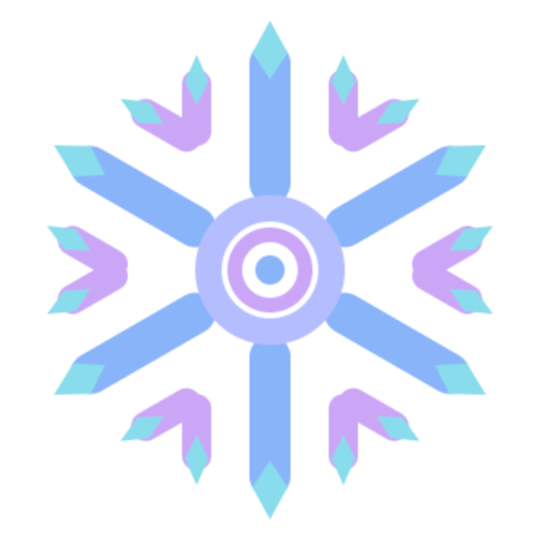

<div align="center">


# Roudix
### NixOS configuration — Niri · Noctalia · CachyOS Kernel


</div>

---

## Hardware

| Component | Model |
|-----------|-------|
| CPU | Intel Core i5-13600KF |
| GPU | AMD Radeon RX 7900 XT |

---

## Stack

| Layer | Choice |
|-------|--------|
| OS | NixOS unstable |
| Kernel | CachyOS (linux-cachyos-lts-lto-v3) |
| Bootloader | Limine |
| Compositor | Niri (scrollable tiling Wayland) |
| Shell | Noctalia |
| Display Manager | GDM / SDDM / plasma-login-manager |
| Terminal | Ghostty |
| Shell | Fish |
| Browser | Zen Browser + Helium (configurable) |
| File Manager | Nautilus |
| Editor | Zed |
| Music | Spotify + Spicetify (Comfy theme) |

---

## Structure

```
roudix/
├── roudix-installer.nix            # a pretty bad Bash-based installer
├── flake.nix                       # Inputs & outputs — set username here
├── flake.lock
├── hosts/
│   └── roudix/                     # Single host — DE selected via roudix.desktop.type
│       ├── configuration.nix
│       ├── local.nix               # gitignored — your personal overrides
│       ├── local.nix.example       # copy this to local.nix to get started
│       └── hardware-configuration.nix
├── home/
│   ├── common.nix                  # Shared home-manager config (all users)
│   └── niri.nix                    # Home config for Niri + Noctalia user
├── dotfiles/
│   ├── easyeffects/                # EasyEffects presets
│   └── niri/
│       ├── cfg/                    # Niri config
│       ├── config.kdl
│       └── noctalia.kdl            # Noctalia config
├── pkgs/
│   └── roudix-switcher/            # Roudix Desktop Switcher package
└── modules/
    ├── common.nix                  # Shared system config (all hosts)
    ├── desktop/
    │   ├── default.nix             # Desktop option (roudix.desktop.type)
    │   ├── niri.nix                # Niri + UWSM + polkit
    │   ├── gnome.nix               # GNOME
    │   └── kde.nix                 # KDE Plasma 6 + plasma-login-manager
    ├── chromium.nix                # Chromium browser selection (roudix.chromium)
    ├── boot.nix                    # Limine bootloader + multi-OS entries
    ├── cpu.nix                     # CPU configuration (Intel/AMD microcode)
    ├── fastfetch.nix               # Fastfetch + fish autostart
    ├── fish.nix                    # Fish shell + aliases + roudix-switch
    ├── flatpak.nix                 # Flatpak service + auto update
    ├── fstrim.nix                  # fstrim for SSD/NVMe
    ├── gaming.nix                  # Steam, Gamescope, GameMode (system)
    ├── gaming-home.nix             # User gaming packages
    ├── git.nix                     # Git config
    ├── gpu.nix                     # GPU configuration (AMD/NVIDIA/Intel)
    ├── hosts-gta.nix               # BattlEye hosts block (GTA fix, optional)
    ├── kernel.nix                  # CachyOS kernel variant selection
    ├── mangohud.nix                # MangoHud overlay
    ├── papirus-folders.nix         # Papirus folder color configuration
    ├── pipewire.nix                # PipeWire audio configuration
    ├── spicetify.nix               # Spotify + Spicetify (Comfy theme)
    ├── ssh.nix                     # SSH + GitHub
    ├── autoupdate.nix              # Auto git pull + rebuild on config changes
    ├── update.nix                  # Auto-update configuration
    ├── virtualization.nix          # QEMU/KVM (disabled by default)
    └── vm-guest.nix                # VM guest optimizations (DNS, QEMU agent)
```

---

## Flake inputs

| Input | Source |
|-------|--------|
| nixpkgs | nixos-unstable |
| nixpkgs-stable | nixos-25.11 |
| home-manager | nix-community/home-manager |
| noctalia | noctalia-dev/noctalia-shell |
| noctalia-qs | noctalia-dev/noctalia-qs |
| nix-cachyos-kernel | xddxdd/nix-cachyos-kernel |
| zen-browser | 0xc000022070/zen-browser-flake |
| spicetify-nix | Gerg-L/spicetify-nix |
| millennium | SteamClientHomebrew/Millennium |
| helium | AlvaroParker/helium-nix |
| nix-flatpak | gmodena/nix-flatpak |
| glf-os | framagit.org/gaming-linux-fr/glf-os |

---

## Configurations

| Name | Description |
|------|-------------|
| `roudix` | Single config — desktop selected via `roudix.desktop.type` |

---

## Desktop environments

Switch desktop at any time with `roudix-switch <de>` or the **Roudix Desktop Switcher** GUI — no separate host needed.

| Value | Desktop | Notes |
|-------|---------|-------|
| `niri` | Niri + Noctalia | Default — scrollable tiling Wayland |
| `gnome` | GNOME 49.4 |
| `kde` | KDE Plasma 6 | plasma-login-manager, KDE Connect |

To change permanently, edit `hosts/roudix/local.nix`:

```nix
roudix.desktop.type = "niri"; # "niri", "gnome" or "kde"
```

Or use the fish function:

```fish
roudix-switch kde
```

> **Note:** `roudix-switch` uses `nh os boot` — changes apply on next reboot.

---

## Features

**Kernel & Performance**
- CachyOS kernel with NTSync enabled (`ntsync` module)
- 8 kernel variants available (set in `hosts/roudix/local.nix`)
- ZRAM enabled (100% RAM, zstd, swappiness 150)
- zswap disabled
- CPU microcode auto-configured (Intel or AMD)
- Intel: `split_lock_detect=off` applied automatically
- GameMode enabled

**Boot**
- Limine bootloader — modern, fast, multi-disk support
- Automatic UEFI entry rename to "Roudix"
- Multi-OS boot menu (Windows, other Linux distros on separate ESPs)

**Gaming**
- Steam + Proton-GE + Gamescope session
- Millennium Steam client patcher
- OBS capture env vars pre-configured (`OBS_VKCAPTURE`, `TZ`)
- Custom horizontal MangoHud overlay
- Controller support (Steam Hardware + game-devices-udev-rules)
- 32-bit support for Wine/Steam

**Desktop (Niri)**
- Niri scrollable tiling Wayland compositor
- Noctalia modern shell
- Capitaine Cursors White
- adw-gtk3 + Papirus icons + Papirus Folders
- Discord with Vencord
- Element Desktop with gnome-libsecret
- GNOME Polkit agent
- GDM display manager

**Desktop (GNOME)**
- GNOME 49.4 (follow nixos unstable branch)
- Curated extension set (blur, tiling, vitals, arcmenu...)
- Bloat removed via `environment.gnome.excludePackages`

**Desktop (KDE)**
- KDE Plasma 6 with plasma-login-manager
- KDE Connect enabled
- xdg-desktop-portal-kde
- Plasma taskbar icon fix (systemd user service)
- Curated packages: partitionmanager, kcalc, digikam, vlc...
- Bloat removed (Discover excluded)

**Music**
- Spotify patched with Spicetify
- Comfy theme (local, customized)
- Adblock + hide podcasts extensions

**Browser**
- Configurable Chromium-based browser via `roudix.chromium` option
- Supports `brave`, `helium` (via helium-nix flake), and `vivaldi` (with ffmpeg codecs)
- Vivaldi automatically pulls `vivaldi-ffmpeg-codecs` for H.264/AAC support

**Other**
- OBS Studio with pipewire + vkcapture plugins
- GPU Screen Recorder
- OpenRGB for LED control
- Flatpak with Flathub remote + daily auto-update (via nix-flatpak)
- Blueman Bluetooth manager
- QEMU/KVM + Virt-Manager (optional)
- VM guest optimizations module (DNS, QEMU agent, Spice)
- Nerd Fonts (JetBrains, Noto, Iosevka)
- Roudix Desktop Switcher — GUI to switch DE without terminal
- Auto-update module — pulls config from GitHub and schedules a rebuild when changes are detected

---

## Installation

> ⚠️ **Follow every step carefully before rebuilding.**

### 1. Clone the repo

> **If `git` is not installed** (fresh NixOS install):

```bash
nix-shell -p git --run "git clone https://github.com/RoudineBWT/Roudix.git ~/.config/roudix"
```

> **Otherwise:**

```bash
git clone https://github.com/RoudineBWT/Roudix.git ~/.config/roudix
cd ~/.config/roudix
```

## Automated Installation

**Go into your ~/.config/roudix and open a terminal and do**

```bash
cd ~/.config/roudix
chmod +x roudix-install.sh
./roudix-installer.sh
```

## Manual Installation

### 2. Set your username

Open `flake.nix` and change **only this one line** — everything else adapts automatically:

```nix
username = "roudine"; # ← Change to your username
```

### 3. Replace hardware-configuration.nix

```bash
sudo cp /etc/nixos/hardware-configuration.nix ~/.config/roudix/hosts/roudix/hardware-configuration.nix
```

### 4. Create your local config

**Never edit `configuration.nix` directly** — it gets overwritten on `git pull`.
Instead, create `hosts/roudix/local.nix` (gitignored) for your personal overrides:

```bash
cp hosts/roudix/local.nix.example hosts/roudix/local.nix
```

Then edit `local.nix` to match your hardware:

```nix
{ lib, ... }:
{
  roudix.desktop.type = "niri";               # "niri", "gnome" or "kde"
  hardware.myGpu      = "amd";                # "amd", "nvidia" or "intel"
  hardware.myCpu      = "intel";              # "intel" or "amd"
  hardware.myKernel   = "cachyos-lts-lto-v3"; # see below
  roudix.chromium     = "helium";             # "brave", "helium" or "vivaldi"
}
```

> `local.nix` is listed in `.gitignore` — it will never be overwritten by a `git pull`.

**Available kernel variants:**

| Variant | Description |
|---------|-------------|
| `cachyos-latest` | Standard latest CachyOS kernel |
| `cachyos-latest-v3` | x86_64-v3 optimized (recommended for modern CPUs) |
| `cachyos-latest-lto` | LTO build for better performance |
| `cachyos-latest-lto-v3` | LTO + x86_64-v3 (best performance, modern CPUs only) |
| `cachyos-lts` | Long-term support CachyOS kernel |
| `cachyos-lts-v3` | LTS + x86_64-v3 optimized |
| `cachyos-lts-lto-v3` | LTS + LTO + x86_64-v3 (stable + performance) |
| `cachyos-rc` | Release candidate — bleeding edge, potentially unstable |

> **NVIDIA note:** Only GTX 20xx / RTX series and newer are supported. Open drivers enabled by default for RTX 20xx+ (Turing+). GTX 10xx/16xx are not supported.

> **Spicetify Comfy theme note:** After your first build, copy the color.ini manually:
> ```bash
> cp ~/.config/spicetify/Themes/Comfy/color.ini ~/.config/roudix/modules/spicetify/Comfy/color.ini
> ```
> Then run `rebuild` to apply.

### 5. Update the disk mount

In `hosts/roudix/local.nix`, add a `lib.mkForce` block with your own UUID (or skip if no secondary disk):

```bash
lsblk -f  # find your disk UUID
```

```nix
fileSystems."/mnt/gaming" = lib.mkForce {
  device = "/dev/disk/by-uuid/YOUR-UUID-HERE";
  fsType = "btrfs";
  options = [ "defaults" "nofail" ];
};
```

### 6. Configure Limine multi-boot (optional)

> Skip this step if you only have NixOS on your machine.

Limine can boot other operating systems on separate disks. This requires knowing the **PARTUUID** of each ESP partition (not the filesystem UUID).

**Get your PARTUUIDs:**

```bash
lsblk -o NAME,FSTYPE,SIZE,PARTLABEL,PARTUUID
```

Look for partitions with `vfat` filesystem type and `EFI system partition` label — those are your ESPs.

**Edit `modules/boot.nix`** and replace the placeholder UUIDs:

```nix
extraEntries = ''
  /Windows
    protocol: efi
    path: uuid(YOUR-WINDOWS-ESP-PARTUUID):/EFI/Microsoft/Boot/bootmgfw.efi

  /CachyOS
    protocol: efi
    path: uuid(YOUR-CACHYOS-ESP-PARTUUID):/EFI/limine/BOOTX64.EFI
'';
```

> **Tip:** The EFI path after the UUID depends on the bootloader used by the other OS. Common paths:
> - Windows: `/EFI/Microsoft/Boot/bootmgfw.efi`
> - CachyOS (Limine): `/EFI/limine/BOOTX64.EFI`
> - Arch/Manjaro (GRUB): `/EFI/grub/grubx64.efi`
> - Any distro (fallback): `/EFI/BOOT/BOOTX64.EFI`

If you don't have other OS to add, just leave `extraEntries` empty:

```nix
extraEntries = "";
```

### 7. Update git config

In `modules/git.nix`:

```nix
settings = {
  user.name = "yourname";
  user.email = "your@email.com";
};
```

### 8. Enable/disable optional modules

In `hosts/roudix/local.nix`:

```nix
roudix.gaming.enable         = true;
roudix.flatpak.enable        = true;   # Flatpak + daily auto-update
roudix.fstrim.enable         = true;   # recommended for SSD/NVMe
roudix.virtualization.enable = false;  # enable for QEMU/KVM
roudix.hosts.gtaFix.enable   = true;  # block BattlEye telemetry (GTA fix)
roudix.autoupdate.enable     = true;   # auto pull + nh os boot on changes
```

### 9. Build

> **If flakes and nix-command are not enabled yet** (fresh NixOS install):

```bash
nix --extra-experimental-features 'nix-command flakes' shell nixpkgs#git -c sudo nixos-rebuild switch --flake .#roudix
```

> **Otherwise:**

```bash
sudo nixos-rebuild switch --flake .#roudix
```

Once built, use the fish aliases for all future operations.

---

## Auto-update

When `roudix.autoupdate.enable = true`, the system checks GitHub every hour (and 5 min after boot).
If new commits are detected on `main`, it pulls and runs `nh os boot` — the new config applies on next reboot.
Your `local.nix` is gitignored and never touched.

To configure the interval or branch, override in `local.nix`:

```nix
{ ... }:
{
  roudix.autoupdate.enable   = true;
  roudix.autoupdate.interval = "6h";   # check every 6 hours instead of 1h
  roudix.autoupdate.branch   = "main"; # branch to track
}
```

Check the last run:

```bash
systemctl status roudix-autoupdate
journalctl -u roudix-autoupdate -n 20
```

---

## Aliases

| Alias | Action |
|-------|--------|
| `rebuild` | Apply configuration immediately |
| `update` | Update flake inputs + apply |
| `cleanup` | Remove old generations + garbage collect |
| `noctalia-reload` | Restart Quickshell without logging out |
| `roudix-switch <de>` | Switch desktop environment (applies on next reboot) |

---

## Updating

```bash
update
```
