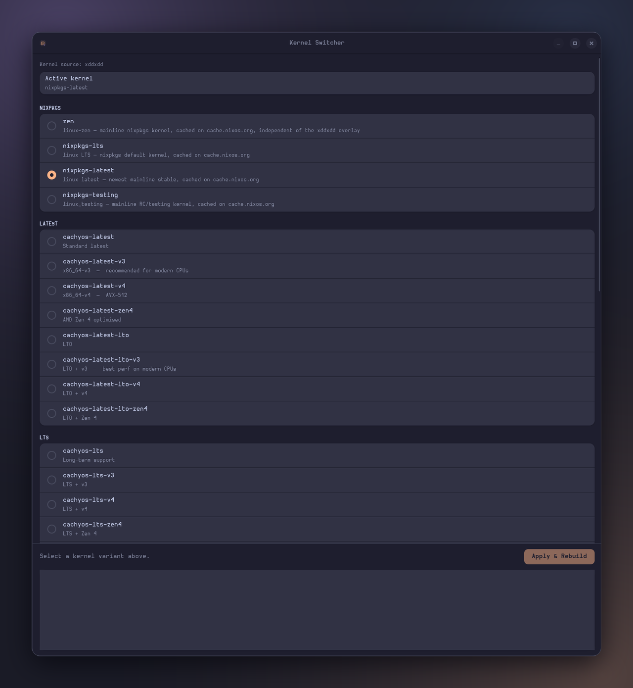

<p align="center"></p>

# roudix-kernel-switcher

GTK4/Adwaita app to switch between kernel variants on Roudix: pick one, confirm,
and it rebuilds the boot entry. SCX scheduler selection lives in its own app,
[`roudix-scheduler`](../roudix-scheduler-switcher/README.md).



## What it does

1. Reads the current kernel from `~/.config/roudix/hosts/<host>/local.nix`
   (`hardware.myKernel`, or `hardware.myKernelChaotic` on nvidia hosts).
2. You pick a variant and confirm.
3. It rewrites that option and runs
   `nh os boot --elevation-strategy pkexec --accept-flake-config ~/.config/roudix`.
4. **Reboot** to boot into the new kernel (it uses `boot`, not `switch`).

The host name is the machine's hostname; override it with `ROUDIX_HOST=<name>`,
and the flake path with `NH_FLAKE`.

## Kernel catalogue

The source depends on `hardware.myGpu`:

| GPU | Kernel source | Groups |
|-----|---------------|--------|
| anything but nvidia | xddxdd CachyOS kernels | Nixpkgs · Latest · LTS · Variants |
| nvidia | Chaotic-Nyx (ships the matching `nvidia_cachyos` driver) | Nixpkgs · Chaotic-Nyx |

- **Nixpkgs**: `zen`, LTS, latest, testing — cached on cache.nixos.org.
- **Latest / LTS**: standard, `x86_64-v3`, `x86_64-v4`, Zen 4, each with or without LTO.
- **Variants**: BORE, BMQ, EEVDF, hardened, real-time, Deckify, server, RC (+ LTO builds).
- **Chaotic-Nyx** (nvidia): default (LTO + BORE), LTS, server, hardened — no LTO builds
  on purpose, as they are more fragile with out-of-tree modules like nvidia.

Kernels outside cache.nixos.org may compile locally on first build.

## Files

| File | Role |
|------|------|
| `roudix-kernel-switcher.py` | The app |
| `roudix-kernel-switcher.svg` | App icon |
| `default.nix` | Package and `.desktop` entry |

## Run

```bash
roudix-kernel-switcher
```
