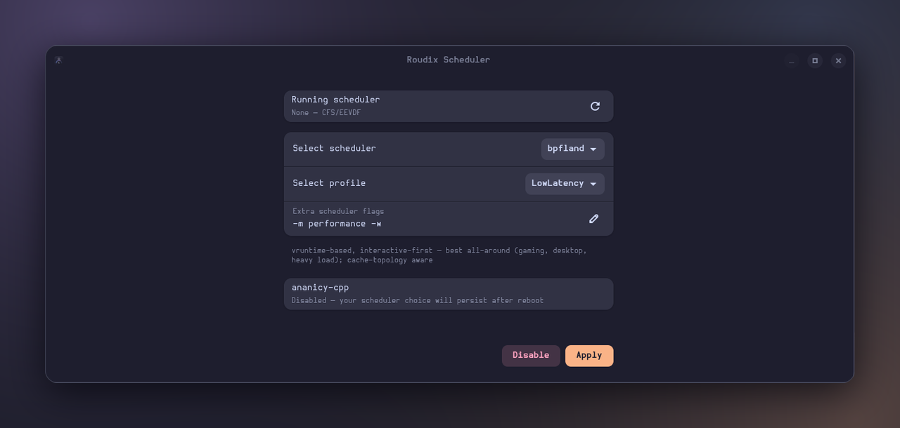

<p align="center"></p>

# roudix-scheduler

GTK4/Adwaita app to choose and apply an [SCX](https://github.com/sched-ext/scx)
(sched-ext) scheduler on Roudix, in the spirit of CachyOS's "Configure sched-ext".
The Nix package is `roudix-scheduler-switcher`; the binary and desktop id are `roudix-scheduler`.



## What it does

- Lists the SCX schedulers (`bpfland`, `lavd`, `flash`, `p2dq`, `rusty`, `cosmos`...) with a
  short description of each, plus **None** for the default kernel scheduler.
- Profile: `Auto`, `Gaming`, `LowLatency`, `PowerSave` or `Server`. Only the profiles a
  given scheduler supports are enabled.
- **Extra flags** field, auto-filled with the scx-loader defaults for the chosen
  scheduler + profile (e.g. `-m powersave`), and editable.
- Shows what is running now (`scxctl get`) and the state of `ananicy-cpp`.
- Remembers your last choice, even if you didn't apply it, in `~/.config/roudix-scheduler/state.json`.
- **Disable** stops the SCX scheduler (`scx-switch unset`).

## How it applies

All root work goes through a single `pkexec scx-switch set <scheduler> <mode> <flags>`
call (the helper is installed by the `scx.nix` module), so there is one password
prompt per action. `scxctl` and `systemd` are added to the app's `PATH` by the package.

Logs: `~/.local/share/roudix-scheduler/scheduler.log`.

## Files

| File | Role |
|------|------|
| `roudix-scheduler.py` | The app |
| `io.roudix.scheduler-dark.svg` / `io.roudix.scheduler-light.svg` | App icon (dark / light) |
| `default.nix` | Package, wrapper and `.desktop` entry |

## Run

```bash
roudix-scheduler
```
