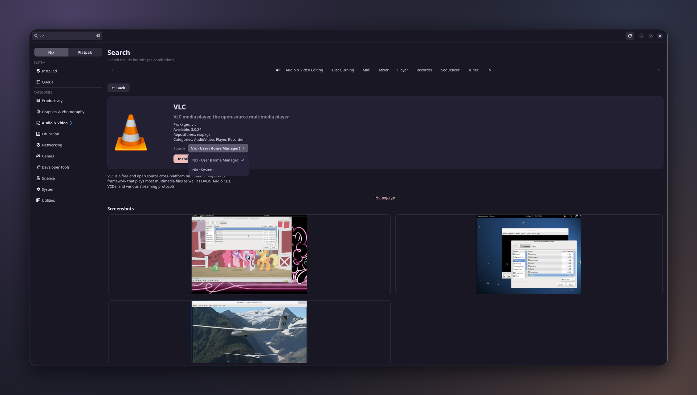
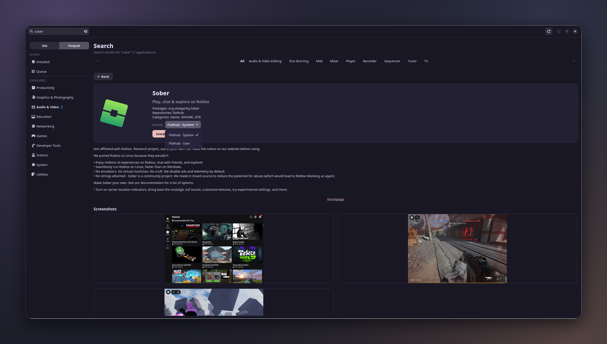

# roudix-store

Software center for Roudix. UI and AppStream catalog code derived from
Nobara's [dnf-app-center](https://github.com/Nobara-Project/dnf-app-center)
(GPL-2.0, see `COPYING`); the libdnf5 backend is replaced by `nix_backend.py`.

**Nix tab** — nixpkgs apps, with a *Source* chooser for Home Manager (user) or system:



**Flatpak tab** — Flathub apps, with a *Source* chooser for the system or user installation:



- Catalog / icons: `nixos-appstream-data` (flake input), via libappstream.
- Search beyond AppStream apps: nixpkgs `packages.json.br`, cached 7 days.
- Install/remove: edits a managed block in `local.nix`
  (`roudix.store.packages` → modules/home, `roudix.store.systemPackages` → hosts/<host>),
  then `nh os switch`. A failed rebuild restores both files.
  On an app's page, the **Source** chooser picks where it goes: *Nix · User (Home Manager)* or *Nix · System*.
  Each source already holding the app is marked "(installed)", and the button reads Install or Remove for the
  chosen source (so one app can be in both).
- Flatpak support on demand (`flatpak_support.py`): when Flatpak is not installed on the system
  (`roudix.flatpak.enable` off) the Flatpak tab is hidden and the sidebar shows an *Enable Flatpak support…*
  button. It writes `roudix.flatpak.enable = true;` to the host `local.nix` (an existing hand-written line is
  edited in place), runs one `nh os switch`, then `flatpak update --appstream`, and asks to restart the store.
  A failed rebuild restores `local.nix`.
- `flatpak update --appstream` also runs once, in the background, the first time the store starts with Flatpak
  available (marker: `~/.local/state/roudix-store/flatpak-appstream-v1`), then the catalog is reloaded.
- Flatpak tab (Nix | Flatpak switch in the sidebar): Flathub and Flathub Beta metadata come from what `flatpak`
  already downloaded (`flatpak update --appstream`), read remote by remote from the system and user installations.
  An app is listed once; on its page, a **Source** chooser (like GNOME Software) lets you pick where it comes from:
  Flathub or Flathub Beta, in the system or the user installation. The button then reads Install or Remove for that
  source, and every source already holding the app is marked "(installed)". Installs are recorded in `local.nix`
  (gitignored) and handed to nix-flatpak on the next switch:

  | remote        | system (`hosts/<host>/local.nix`) | user (`modules/home/local.nix`)     |
  |---------------|-----------------------------------|-------------------------------------|
  | flathub       | `roudix.store.flatpaks`           | `roudix.store.flatpaksUser`         |
  | flathub-beta  | `roudix.store.flatpaksBeta`       | `roudix.store.flatpaksUserBeta`     |

  Flatpak changes **don't trigger a rebuild**: a batch that only touches Flatpaks runs `flatpak install` /
  `flatpak uninstall` directly (adding the remote to a user installation when needed, then cleaning unused
  runtimes with `flatpak uninstall --unused` in the scope it touched) and records the result in `local.nix`,
  so the next rebuild finds nothing to do. System installs ask for authorization through polkit. If the batch
  also contains Nix packages, it still goes through `nh os switch`, and nix-flatpak applies the Flatpak lists.
  A failing app doesn't block the others in the batch; only the ones that succeeded are recorded.

  Requires `roudix.flatpak.enable = true` for the system installation (user installs also use that Flatpak setup).
- Not supported (by design): updates page, repositories, RPM drops — updates come from the flake.

## Apps installed outside the store

- **Flatpak** installed by hand: listed as installed, and removable from the store
  (it runs `flatpak uninstall`, no rebuild; system ones ask for authorization through polkit).
- **Nix** apps that come from the Roudix configuration, a flake, an overlay or a profile (not from
  the store's `local.nix` block): the store can't read your flake inputs, but it sees what ends up
  installed. It scans the `.desktop` files of `/run/current-system/sw` and the user profiles
  (`/etc/profiles/per-user/$USER`, `~/.nix-profile`), so every installed GUI app shows under
  *Installed*, flagged "installed via config". Apps the AppStream catalog doesn't know get an entry
  built from their `.desktop` file. The store can't remove them — edit your configuration instead.
  CLI-only packages (no `.desktop` file) and flake apps you only `nix run` are not listed.

## Index cache

The nixpkgs index (search beyond the AppStream apps, versions) is cached in
`~/.cache/roudix-store/index.json`. It is read from disk at startup, whatever its age, and
revalidated in the background at most once a week with a conditional request (`ETag`): an
unchanged index costs one tiny `304`, and when you're offline the cached copy keeps working
(the next attempt waits an hour). The refresh button forces a check; delete the cache
directory to start from scratch.

## Catalog cache

The parsed AppStream catalog (nixpkgs + the Flatpak remotes) is cached in
`~/.cache/roudix-store/catalog.json`, so only the very first start waits for the parsing. The cache
remembers what it was built from (the nixos-appstream-data store path, each Flatpak remote's
`appstream.xml.gz`, the language): when a new package arrives — a flake update, a refreshed
Flathub — it is rebuilt automatically on the next start.

## Packages from your flakes

`roudix.store.flakeSources` (in `modules/system/packaging/store.nix`) lists the flake inputs the
store offers next to nixpkgs: their `packages.<system>` are written, at every switch, to
`/etc/roudix-store/flake-catalog.json`, which the store reads. A package that also exists in
nixpkgs (same attribute, or an entry of the flake's `aliases`) is **not** a second app: it is one
more entry in that app's *Source* chooser. The others are apps of their own, found by search.
Installing one records `"<flake>#<attr>"` in `roudix.store.flakePackages` (user) or
`roudix.store.systemFlakePackages` (system), resolved from `inputs.<flake>.packages.<system>`.

```nix
# in hosts/<host>/local.nix: offer another input, or tune one (a field you set replaces Roudix's default for it)
roudix.store.flakeSources.my-flake = { label = "My flake"; exclude = [ "internal-tool" ]; aliases = { foo-custom = "foo"; }; };
```
