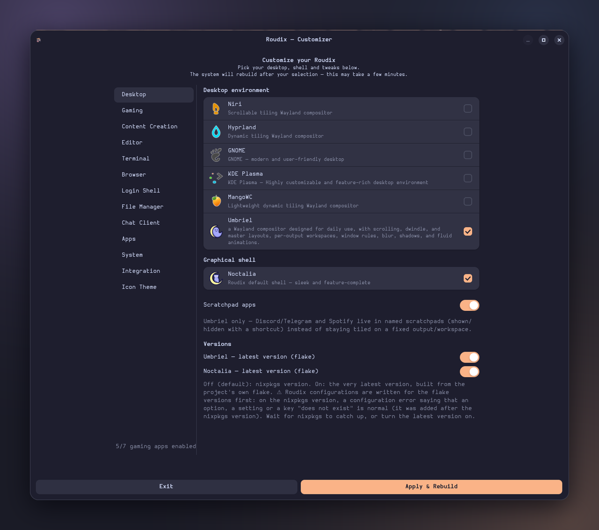

<p align="center"></p>

# roudix-switcher

GTK4/Adwaita app to customize a Roudix system without editing Nix by hand
(shown as **Roudix Customizer** in the menu). Pick your desktop, shell, apps
and system tweaks, hit apply, and it rebuilds the system for you.



## What it does

- Writes your choices into the gitignored `local.nix` files, then runs
  `nh os switch` / `nh os boot` with `--elevation-strategy pkexec`:
  - system options → `~/.config/roudix/hosts/<host>/local.nix`
  - Home Manager options → `~/.config/roudix/modules/home/local.nix`
- The host name is the machine's hostname (= its `hosts/<name>/` directory).
  Override it with `ROUDIX_HOST=<name>` to test against another host's `local.nix`.
- Can also switch the Roudix git branch (`main` / `testing` / `dev`).
- Bilingual: French or English, picked from `LC_ALL` / `LANG`.

## Pages

| Page | What you pick |
|------|---------------|
| Desktop | Compositor / DE (Niri, Hyprland, GNOME, KDE, Cinnamon, MangoWC, Umbriel) and shell (Noctalia, DMS, Caelestia on Hyprland, Umbriel variants) |
| Gaming | Launchers and tools (Lutris, Heroic, Faugus, Prism, MangoHud...), Ananicy, Decky, gamescope session... |
| Content Creation | OBS Studio, its plugins, virtual camera, video editor |
| Editor / Terminal / Browser / Login Shell / File Manager | Default app of each kind |
| Chat Client | Matrix, Discord, Telegram clients |
| Apps | Optional apps (GIMP, Inkscape, EasyEffects...), media players, mail, torrent |
| System | Flatpak, virtualization, Waydroid, auto-update, laptop/TLP, Podman, Distrobox... |
| Integration | GNOME / KDE app integration for the tiling compositors |
| Icon Theme | Papirus, Tela, Qogir, WhiteSur, Colloid — with live folder-icon previews |

Some options only appear for the compositors that support them.

## Per-host option filter

A host can restrict what the app offers by putting `# roudix-installer: only-listed`
in its `hosts/<name>/local.nix.example`: only the options listed in that file are
shown and written. A line tagged `# roudix-installer: fixed` is specific to that
machine and is never offered. Without the marker, everything is shown.
This is the same contract as `roudix-installer`.

## Files

| File | Role |
|------|------|
| `roudix-switcher.py` | The app |
| `roudix-switcher.svg` / `roudix-switcher-light.svg` | App icon (dark / light) |
| `io.roudix.switcher.policy` | Polkit action for the rebuild |
| `icons/` | App icons shown in the selectors |
| `default.nix` | Package; also pulls the icon-theme packages used for the Icon Theme previews |

## Run

```bash
roudix-switcher
```
